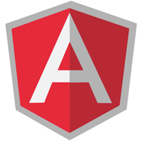
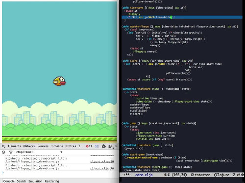
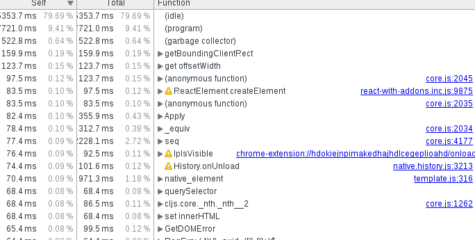
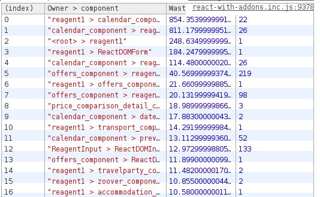
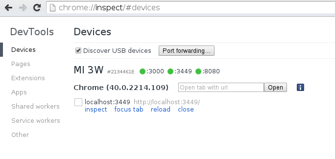

## Max Gonzih

# Reagent in production

### 

<!--slide-->

## Max Gonzih

## [gonzih.me](http://gonzih.me)
## [github.com/Gonzih](http://github.com/Gonzih)
## [@Gonzih](http://twitter.com/Gonzih)

<!--slide-->

## Elmar Reizen B.V.

### 
##### [vakantiediscounter.nl](http://www.vakantiediscounter.nl/)

<!--slide-->

# Stack origins

Seam + Query -> Rails + Knockout -> Rails + Angular -> Rails + cljs + Reagent

<!--slide-->

# Stack origins

## Seam + JQuery

## 

<!--slide-->

# Stack origins

## Rails + ClojureScript + Reagent

## 


<!--slide-->

# Why did we decide to migrate?

## "Legacy" angular code without motivated maintainer

### 

<!--slide-->

# Why ClojureScript?

## We like ideas and simplicity of React.js

## React feels limited by JavaScript

###  

<!--slide-->

# Why Reagent and not Om?

* Distributed state
* No need to use core.async so much for the inter-component communications, just use shared state
* Similar level of flexibility
* Simplicity in theory should speedup learning process

<!--slide-->

# Where are we so far?

* 5k cljs LOC on top of 5k LOC rails app

```bash
wc -l {src,test}/**/*.clj? | tail -n 1
> 5185 total

wc -l {app,lib,spec,test}/**/*.rb | tail -n 1
> 5529 total
```


<!--slide-->

# Learning curve

* 4.5 Scala engineers learned clojure script in one day
* Initial introduction was done in the form of workshop
* In one week people were writing production code without asking for help (with Angular this time was about one month)
* Just building UI without a hassle :)

## 

> > There are no concepts, only parenthesis

> > I still cannot write javascript, but I'm fluent in clojurescript

<!--slide-->

# Isomorphic ClojureScript

* Server side rendering via V8 in ruby
  * You want to show something to the user fast
  * You also probably want to be indexed by google

```ruby
cxt = V8::Context.new
# react expects couple of vars to be defined
cxt.eval(setup_js) # setup global vars for react
cxt.eval(File.open("/path-to-assets/server-side.js").read)
cxt.eval(init_state_script) # init your state
cxt.eval("vd.core.details_page.render_to_string()")
```

Which is:
* Memory hungry
* Fast enough

<!--slide-->

# Development

* vim + paredit + fireplace.vim/tmux
  * you don't really need fireplace or repl to work with clojurescript thanks to figwheel
* Intellij with clojure plugin (LaClojure)


* lein-figwheel
* Different optimization modes for dev/production
  * no optimization for figwheel
  * advanced optimization mode for production
  * simple optimization mode for server side rendering (v8 exceptions are not so informative)


* Rails integration is not hard
* CLJS life cycle is outside of rails pipeline


* Environment specific macro due to RAILS_ENV and friends

```clojure
(in-production
  (def secure-key "key")
  (do-some-additional-call))
```

<!--slide-->

# Advanced optimization mode

* Advanced compilation is not so scary once you understand what is going on underneath
* Writing extern files looks like this:

```javascript
var window = {};
window._gaq = function(arg) {};
```

* Extern file will guarantee that closure compiler will not rename those calls (helpful when you use external JS libraries)

<!--slide-->

# Testing

* ~~cemerick/clojurescript.test~~ cljs.test
* focus on functional testing
* no tests for components (feels like view testing)

<!--slide-->

# Profiling

* In-browser profiling tools are not so helpful



<!--slide-->

# Profiling

* React.addons.Perf is your friend
* Try to reduce wasted time



<!--slide-->

# Mobile profiling

* Remote debugging on android is your friend


<!--slide-->

# Mobile profiling

* lein-figwheel + port forwarding = ❤



* Use perf tools on real device
* Slower devices will help to understand your application better

<!--slide-->

# Final thoughts

<!--slide-->

# Thanks!

## Any questions?

##### [gonzih.me](http://gonzih.me)
##### [github.com/Gonzih](http://github.com/Gonzih)
##### [@Gonzih](http://twitter.com/Gonzih)
##### [github.com/Gonzih/presentation-tool](https://github.com/Gonzih/presentation-tool)
