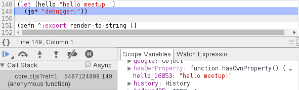

# Max Gonzih

##### [gonzih.me](http://gonzih.me)
##### [github.com/Gonzih](github.com/Gonzih)
##### [@Gonzih](twitter.com/Gonzit)

# Reagent in production

<!--slide-->

# Why we decided to migrate

* "Legacy" angular code without motivated maintainer
* React hype

<!--slide-->

# Why ClojureScript?

* Better language semantically
* Better language syntactically
* React feels limited by JavaScript

<!--slide-->

# Adoption

* 4.5 Scala engineers learned clojure script in one day
* in few week people were writing production code without asking for help

<!--slide-->

# That was fast...

* Prior FP experience
* Partially because I'm working with exceptional people :)

<!--slide-->

# Clojure is esasy

> there are no concepts, only parenthesis

<!--slide-->

# Clojure is simpler

> some of engineers recently admitted that they still cannot write javascript, but they are fluent in clojurescript

<!--slide-->

# Why reagent and not om?

* Distributed state
* Simplicity

<!--slide-->

# Where are we so far?

* 4k cljs loc on a single page in 5k loc rails app

```bash
wc -l {src,test}/**/*.clj? | tail -n 1
> 4200 total

wc -l {app,lib,spec,test}/**/*.rb | tail -n 1
> 4997 total
```

* Easy server side rendering via v8 in ruby
* Happy customers

<!--slide-->

# Development

* vim + fireplace.vim
* vim + tmux + tslime2
* cursive clojure

<!--slide-->

# Development

* Rails integration is not hard
* CLJS life cycle is outside of rails pipeline
* Different optimization modes for dev/production
* Environment specific macro

# Development

* Advanced compilation is not so scary once you understand what is going on underneath
* Writing extern files is easy

<!--slide-->

# Testing

* cemerick/clojurescript.test
* focus on function testing
* no tests for components (feels like view testing)
* would be better to use cljs.test

```clojure
(in-production
  (do-some-additional-call))
```

<!--slide-->

# Debugging

* console.table

```clojure
(defn map-values [f coll]
  (into {} (map (fn [[k v]] [k (f v)])
                coll)))

(defn table
  [coll]
  (js/console.table
    (clj->js
      (map (partial map-values str) coll))))
```

<!--slide-->

# Debugging

* trace

```clojure
(defn trace [something]
  (prn something)
  something)
```

<!--slide-->

# Debugging

* (js* "debugger;") + sourcemaps



<!--slide-->

# Profiling

* In-browser profiling tools are not so helpful


<!--slide-->

# Profiling

* React.addons.Perf is your friend
* Try to reduce wasted time


<!--slide-->

# Mobile profiling

* Remote debugging on android is your friend


<!--slide-->

# Mobile profiling

* lein-figwheel + port forwarding = ❤


<!--slide-->

# Optimizing

* memoize (reduces parent component overhead)
* make sure that your components are pure in that case

```clojure
(defonce visible (atom false))
(defonce some-collection (atom []))

(defn inner-compoment [item]
  ...)

(def inner-component-memo (memoize inner-component))

(def main-component []
  [:div {:class (when-not @vibisle "hidden")}
    (map inner-component-memo @some-collection)])
```

<!--slide-->

# Optimizing

* reactive deref = force update in react
* cursor (reduces state update overhead)

```clojure
(defonce shared-state (atom {}))

(defonce sub-state-1 (cursor shared-state [:path-1]))
(defonce sub-state-2 (cursor shared-state [:path-2]))

(defn component-one [] [:div @sub-state-1])
(defn component-two [] [:div @sub-state-2])

(defn main-component []
  [:div
    [component-one]
    [component-two]])
```

<!--slide-->

# Final thoughts

* Think how to split your state
* Think about your updates
* ClojureScript overhead is a least thing that you should be worried about
* ClojureScript can do performance tricks (transducers, transients, local mutations, arrays)

<!--slide-->

# Thanks!

##### [gonzih.me](http://gonzih.me)
##### [github.com/Gonzih](github.com/Gonzih)
##### [@Gonzih](twitter.com/Gonzit)
